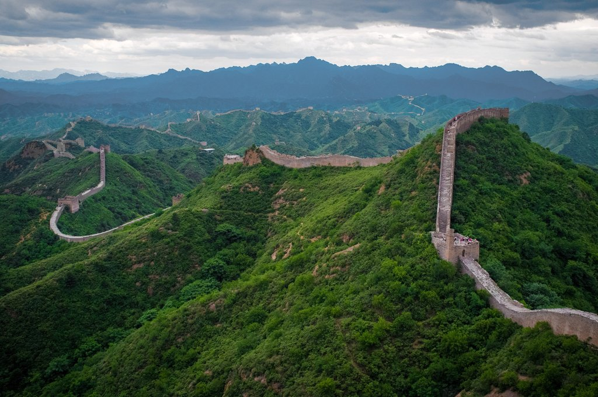

# Great Wall of China

## Description

Target: great_wall_of_china.description

The Great Wall of China (traditional Chinese: 萬里長城; simplified Chinese: 万里长城; pinyin: Wànlǐ Chángchéng, literally "ten thousand li long wall") is a series of fortifications in China. They were built across the historical northern borders of ancient Chinese states and Imperial China as protection against various nomadic groups from the Eurasian Steppe. The first walls date to the 7th century BC; these were joined together in the Qin dynasty. Successive dynasties expanded the wall system; the best-known sections were built by the Ming dynasty (1368–1644).
To aid in defense, the Great Wall utilized watchtowers, troop barracks, garrison stations, signaling capabilities through the means of smoke or fire, and its status as a transportation corridor. Other purposes of the Great Wall have included border controls (allowing control of immigration and emigration, and the imposition of duties on goods transported along the Silk Road), and the regulation of trade. 
The collective fortifications constituting the Great Wall stretch from Liaodong in the east to Lop Lake in the west, and from the present-day Sino-Russian border in the north to Tao River in the south: an arc that roughly delineates the edge of the Mongolian steppe, spanning 21,196.18 km (13,170.70 mi) in total. It is a UNESCO World Heritage Site, and was voted one of the New 7 Wonders of the World in 2007. Today, the defensive system of the Great Wall is recognized as one of the most impressive architectural feats in history.

## Image

Target: great_wall_of_china.image

The image above shows Great Wall of China — Series of fortifications in northern China.
