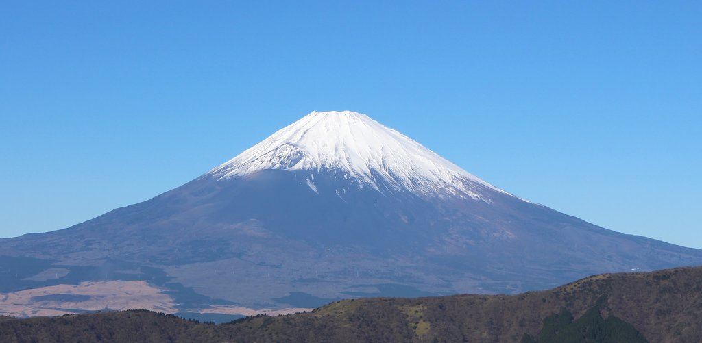

# Mount Fuji

## Description

Target: mount_fuji.description

Mount Fuji (富士山・富士の山, Fujisan, Fuji no Yama) is an active stratovolcano located on the Japanese island of Honshu, with a summit elevation of 3,776.24 m (12,389 ft 3 in). It is the highest mountain in Japan, the second-highest volcano on any Asian island (after Mount Kerinci on the Indonesian island of Sumatra), and the seventh-highest peak of an island on Earth. Mount Fuji last erupted from 1707 to 1708. 
It is located about 100 km (62 mi) southwest of Tokyo, from which it is visible on clear days. It has an exceptionally symmetrical cone, which is covered in snow for about five months of the year. It is a Japanese cultural icon and is frequently depicted in art and photography, as well as visited by sightseers, hikers, and mountain climbers.
Mount Fuji is one of Japan's "Three Holy Mountains" (三霊山, Sanreizan) along with Mount Tate and Mount Haku. It is a Special Place of Scenic Beauty and one of Japan's Historic Sites. It was added to the World Heritage List as a Cultural Site on June 22, 2013. According to UNESCO, Mount Fuji has "inspired artists and poets and been the object of pilgrimage for centuries". UNESCO recognizes 25 sites of cultural interest within the Mount Fuji locality. These 25 locations include Mount Fuji and the Shinto shrine, Fujisan Hongū Sengen Taisha.

## Image

Target: mount_fuji.image

The image above shows Mount Fuji — Volcano in Japan.
