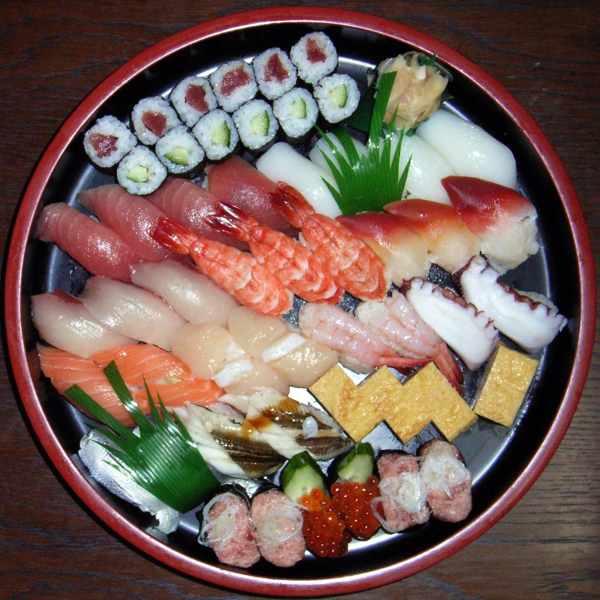

# Sushi

## Description

Target: sushi.description

Sushi (すし, 寿司, 鮨, 鮓; pronounced [sɯɕiꜜ] or [sɯꜜɕi] ) is a traditional Japanese dish made with vinegared rice (鮨飯, sushi-meshi), typically seasoned with sugar and salt, and combined with a variety of ingredients (ねた, neta), such as seafood, vegetables, or meat; raw seafood is the most common, although some may be cooked. While sushi has numerous styles and presentations, the current defining component is the vinegared rice, also known as shari (しゃり), or sumeshi (酢飯).
The modern form of sushi is believed to have been created by Hanaya Yohei, who invented nigiri-zushi, the most commonly recognized type today, in which seafood is placed on hand-pressed, vinegared rice. This innovation occurred around 1824 in the Edo period (1603–1867). It was the fast food of the chōnin class in the Edo period.
Sushi is traditionally made with medium-grain white rice, although it can also be prepared with brown rice or short-grain rice. It is commonly prepared with seafood, such as squid, eel, yellowtail, salmon, tuna, or imitation crab meat (surimi). Certain types of sushi are vegetarian. It is often served with pickled ginger (gari), wasabi, and soy sauce. Daikon radish or pickled daikon (takuan) are popular garnishes for the dish.
Sushi is sometimes confused with sashimi, a dish that consists of thinly sliced raw fish or occasionally meat, without sushi rice. Today, sushi is considered one of the most popular dishes in the world.

## Image

Target: sushi.image

The image above shows Sushi — Japanese dish of vinegared rice and seafood.
